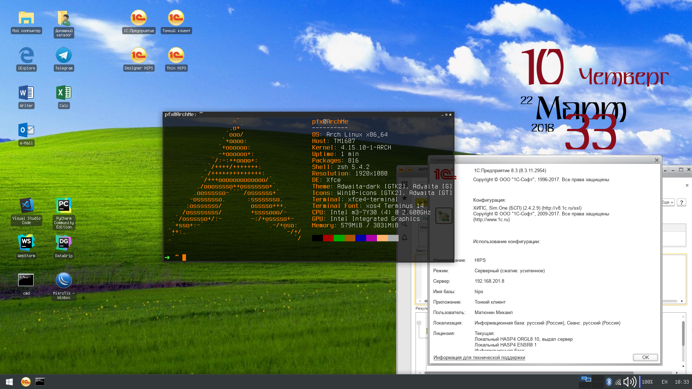
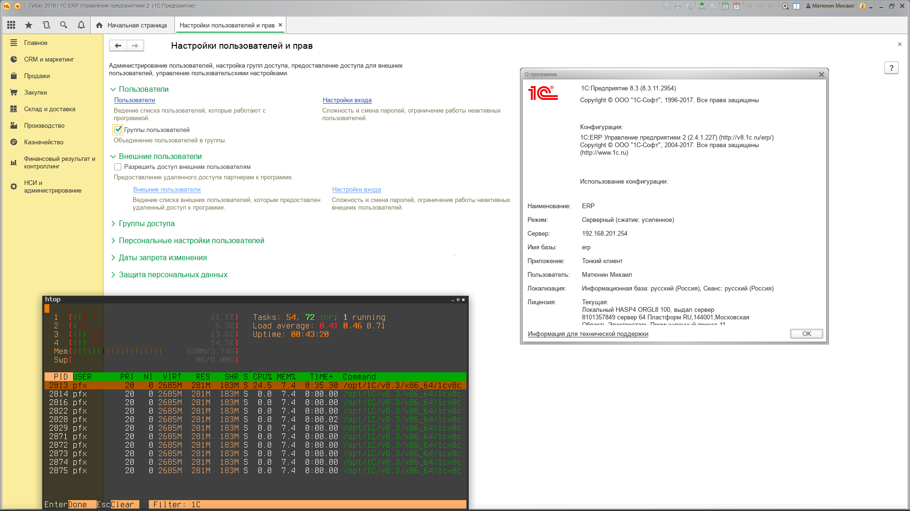

**Подробная установка 1С 8.3 на Arch Linux в 3 чашки кофе без сахара и геморроя.**

### *Вместо предисловия и кратенького ликбеза:*

> Линукс замечательная система как для серверов, так и для разработчиков, но у новичков могут возникнуть некоторые проблемы, в частности и с установкой 1с.
>
> Для debian based дистрибутивов (ubuntu, mint и т.п.) в интернете куча инструкций, да и на сайте 1c распространяются deb бинарники, а вот с арчем все обстоит несколько сложнее.
>
> Арч это третий по степени "гиковости" линукс после gentoo и lfs, позволяет стать чем угодно для своего владельца-арчевода, в тоже время дает великолепную документацию-вики.
>
> Из отличительных особенностей арча - система rolling релизов, всегда предоставляющая своим владельцам самые свежие версии софта (ну и проблемы с ним заодно, бывает).
>
> Данная система ввиду легковесности (особенно если взять композитный LXDE или тайтловый оконный менеджер, например i3) может являть собой великолепный терминал.
>
> У меня на захламленной пакетами xfce4 суммарно вышло всего 600 Мб, 
>
> Для менее уверенных пользователей существует основанный на арче дистрибутив - Manjaro, в последнее время он очень популярен, софт в его репозиториях тщательнее проверяют.
>
> Статья даст точный набор команд необходимых для установки 1с с оговоркой, что вы будете корректировать пути и версии своей 1с.
>
> Также предполагается, что вы знакомы с терминалом и базовыми nix командами. Команды которым необходим root - начинаются с sudo, остальные выполняем из под пользователя.
>
> Если забудите написать super user do, просто следующей командой наберите "sudo !!".
>
> Возможно кто нибудь захочет и возьмет на себя ответственность сделав shell скрипт для автоматической установки.
>
> Также не помешало бы поправить и дополнить статью на арч вики.

 

- ## **I**

Скачиваем дистрибутивы нужной версии (в моем случае 8.3.11.2954) по ссылке [https://releases.1c.ru/project/Platform83](https://infostart.ru/redirect.php?url=aHR0cHM6Ly9yZWxlYXNlcy4xYy5ydS9wcm9qZWN0L1BsYXRmb3JtODM=)
А именно берем пакеты Red Head "Клиент 1С:Предприятия (64-bit) для RPM-based Linux-систем" и "Cервер 1С:Предприятия (64-bit) для RPM-based Linux-систем"
Получаем: client.rpm64.tar.gz и rpm64.tar.gz

 

- ## **II**

Открываем свой любимый эмулятор терминала.
Перемещаем архивы в папку, в которой будем собирать, и разархивируем (заняться этим можно и в папке загрузок, но я предпочитаю не мусорить и заодно создать две папки, исходников "src" и под полученный пакет "pkg", какое никакое, а версионирование):

```bash
mkdir -p ~/git/ones/8.3.11/2954/{src,pkg} && mv ~/d/*rpm64.tar.gz ~/git/ones/8.3.11/2954/src
cd ~/git/ones/8.3.11/2954/src/ && tar -xf rpm64.tar.gz;tar -xf client.rpm64.tar.gz
```

 

- ## **III**

Создаем любимым текстовым редактором файл "PKGBUILD" со следующим содержимым (спасибо товарищу  **tsn**  за PKGBUILD и  **ser**  за страничку на вики, пусть и сыроватую):

 

 

 PKGBUILD

Создаем файл:

```bash
nano PKGBUILD
```

 Заполняем содержимое следующим текстом (попутно меняя два параметра под себя, остальное AS IS):

```
pkgname=1c_enterprise83
_pkgname1c=1C_Enterprise83
if test "$CARCH" == x86_64; then
    _pkgarch1c=$CARCH
else
    _pkgarch1c=('i386')
fi
pkgver=8.3.11         # Поменяйте на вашу версию
pkgrel=2954          # Поменяйте на вашу версию
pkgdesc="1C 8.3 for Linux"
license=('custom')
arch=($CARCH)
options=('!strip')
depends=('webkitgtk2')
makedepends=('pkgextract')
url="www.1c.ru"
source=(
$_pkgname1c-client-$pkgver-$pkgrel.$_pkgarch1c.rpm
$_pkgname1c-client-nls-$pkgver-$pkgrel.$_pkgarch1c.rpm
$_pkgname1c-common-$pkgver-$pkgrel.$_pkgarch1c.rpm
$_pkgname1c-common-nls-$pkgver-$pkgrel.$_pkgarch1c.rpm
$_pkgname1c-server-$pkgver-$pkgrel.$_pkgarch1c.rpm
$_pkgname1c-server-nls-$pkgver-$pkgrel.$_pkgarch1c.rpm
$_pkgname1c-thin-client-$pkgver-$pkgrel.$_pkgarch1c.rpm
$_pkgname1c-thin-client-nls-$pkgver-$pkgrel.$_pkgarch1c.rpm
$_pkgname1c-ws-$pkgver-$pkgrel.$_pkgarch1c.rpm
$_pkgname1c-ws-nls-$pkgver-$pkgrel.$_pkgarch1c.rpm
)

md5sums=('9e296bcc74dfccce0448792838b5e6c0'
         '74d01a7fffecba6df20e5ff164065e89'
         '783f2fa504ff0401f32469ad4b5c1539'
         'a43e505df590d6096921ea367bf7a59e'
         '2465f77b5b3941d37464ea526fa7e529'
         '2db4f7cd9c01ee61f22e18cb2fd51e58'
         '23c71fcc735635fa35e1689a363b9fe8'
         'f40d85c6b1f6bebee5ed15a167f207cb'
         'a7273cc69543fe52983df4506d72edb1'
         '6c2cd6cadd20ef42d8f79c902b703fa6')
package() {
   cd $pkgdir
   cp -r $srcdir/usr $pkgdir
   cp -r $srcdir/etc $pkgdir
   cp -r $srcdir/opt $pkgdir
}
```

pkgver

 

\- Версия технологической платформы. Измените на свою версию.

pkgrel

 

\- Номер сборки. Измените на свою версию.

 

 

- ## **IV**

Теперь обновим контрольные суммы в файле PKGBUILD на свои
`updpkgsums`

 

- ## **V**

Обновим базу данных pacman и установленные пакеты 
`sudo pacman -Syu`
(на арче **НЕОБХОДИМО** обновляться перед любым чихом, лично я добавил себе в алиасы zsh "sudo pacman" как "p", но к теме это относиться мало)

 

- ## **VI**

Для сборки нам наверняка будет не хватать зависимости от пакетов "webkitgtk2" и "pkgextract", их наличие вы можете проверить командой:
`pacman -Qqe | grep -E 'webkitgtk2|pkgextract|imagemagick'`    

 

 

(a) Если не оказалось в списке "pkgextract"

​    pkgextract тянем с аура, мне удобнее git'ом, но тк многим 1с'никам он не нужен, качаем wget'ом (если вы обладатель йогурта, то сами знаете что делать):     

```bash
cd ~/d;wget https://aur.archlinux.org/cgit/aur.git/snapshot/pkgextract.tar.gz
```

​    Разархивируем и ставим (по хорошему предварительно стоит проверить, что мы ставим):     

```bash
tar -xf pkgextract.tar.gz && rm pkgextract.tar.gz;cd pkgextract;makepkg -sri
```

 

 

 

(b) Если не оказалось в списке "webkitgtk2"

​    webkitgtk2 можно собрать самому или скачать с китайского репозитория:
​    Сборка займет целый день машинного времени, но это Ъ gentoo way
​    Мы пойдем быстрым путем, а именно стянем у китайцев.

​    Добавим в /etc/pacman.conf китайский репозиторий:     

```
[archlinuxcn]

Server = https://cdn.repo.archlinuxcn.org/$arch
```

​    Добавим PGP ключи:     

```bash
sudo pacman -Syy && sudo pacman -S archlinuxcn-keyring
```

​    Скачиваем webkitgtk2:     

```bash
sudo pacman -S webkitgtk2
```

 

(c) Если не оказалось в списке "imagemagick"

Я не уверен, что этот пакет необходим для нормального функционирования 1с (отвечает за манипуляции изображениями), но ставится он просто:     

```bash
sudo pacman -S imagemagick
```

​    Да, хоть что то будет просто

 

 

- ## **VII**

Возвращаемся (если уходили) к нашей 1с и пробуем собрать пакет (это займет небольшое время, вполне можно сходить за чайком):
`cd ~/git/ones/8.3.11/2954/src && makepkg -s`
Полученный пакет разлучаем с исходниками:
`mv 1c_enterprise83-*-x86_64.pkg.tar.xz ../pkg/; cd ../pkg/`

 

- ## **VIII**

Устанавливаем наш пакет:
`sudo pacman -U 1c_enterprise83-*-x86_64.pkg.tar.xz`
Приложение находиться по адресу:
`/opt/1C/v8.3/x86_64/1cestart/opt/1C/v8.3/x86_64/1cv8/opt/1C/v8.3/x86_64/1cv8c`
Для удобства можете создать ярлыки и алиасы и быстрый запуск под определенным пользователем.
В xfce автоматически занеслось в Whisker menu, но i3 так не повезет с dmenu.

Пример записи для быстрого логина 1c.desktop

```bash
[Desktop Entry]
Version=1.0
Type=Application
Terminal=false
Exec=/opt/1C/v8.3/x86_64/1cv8c ENTERPRISE /s'baseIP\baseName' /n'myUsername' /p'myPassword'
Categories=Office;Finance;
Name=1C Thin baseName
Icon=1cv8c
```

 

- ## **IX**

В принципе вы уже можете использовать 1c, но при старте ругнется на недостающие шрифты "Microsoft Core Fonts".
Вы можете скопировать недостающие шрифты с установочного диска винды, соседней машины или попросту создать символьную ссылку если сидите дуалбутом.
Если правильно помню, шрифтов там примерно на 500 метров.

Вариант с ссылкой на примонтированный раздел с окнами:
`sudo ln -s /winDiskC/Windows/Fonts /usr/share/fonts/WindowsFontsfc-cache -f`

В случае копирования, просто перемещаете шрифты в папку /usr/share/fonts/WindowsFonts
и обновляете кэш шрифтов:
`fc-cache -f`

*Если кто готов поделиться подборкой необходимых шрифтов для 1с - с удовольствием прикреплю к статье.*



